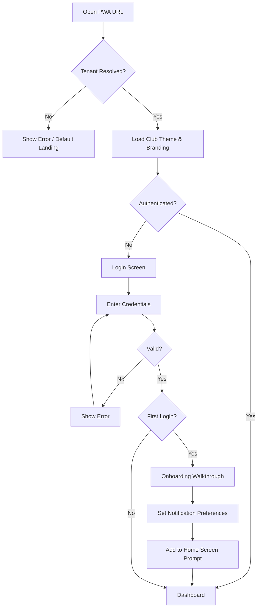
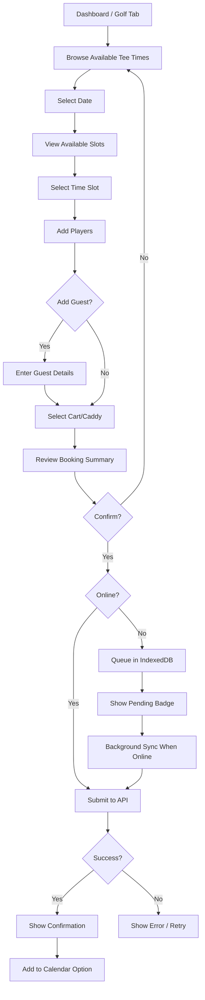
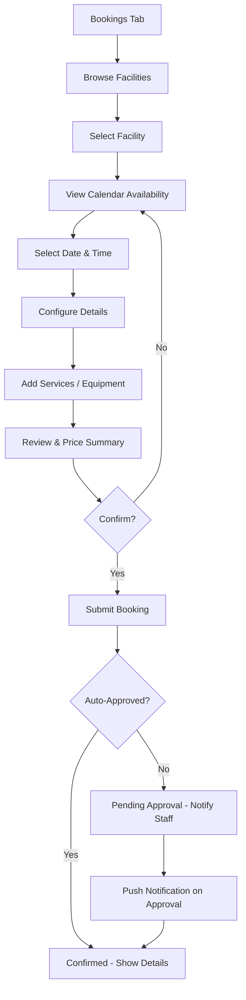
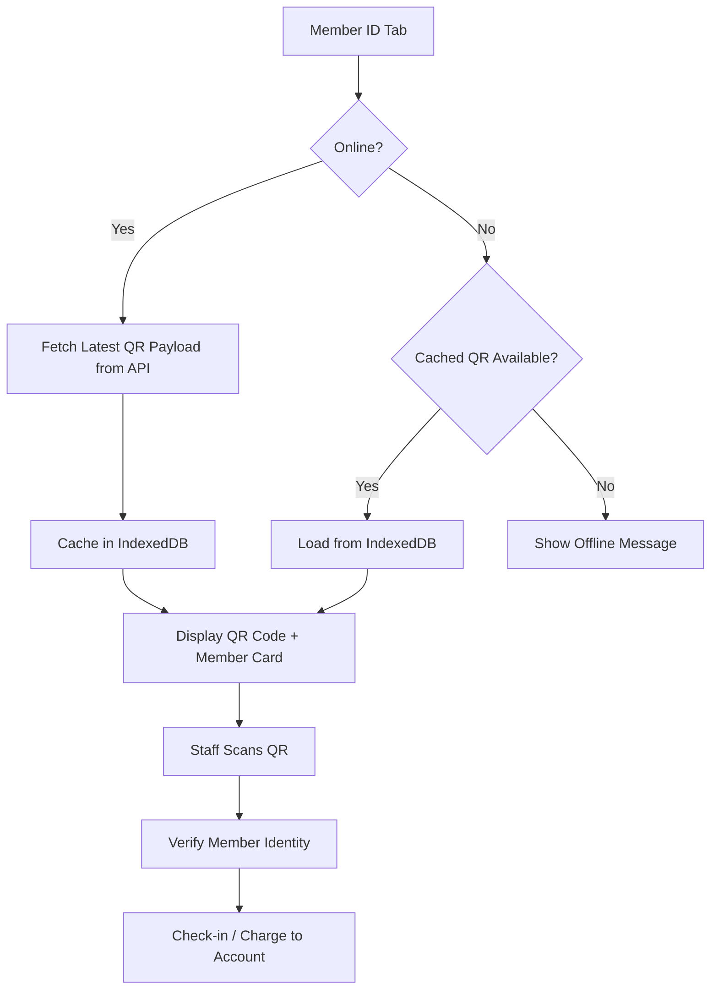
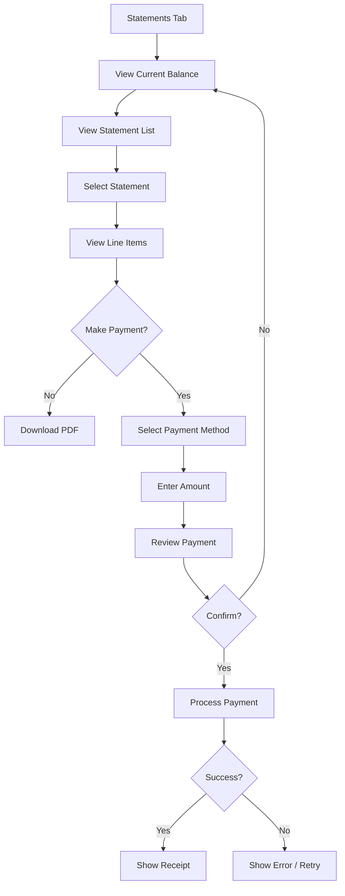
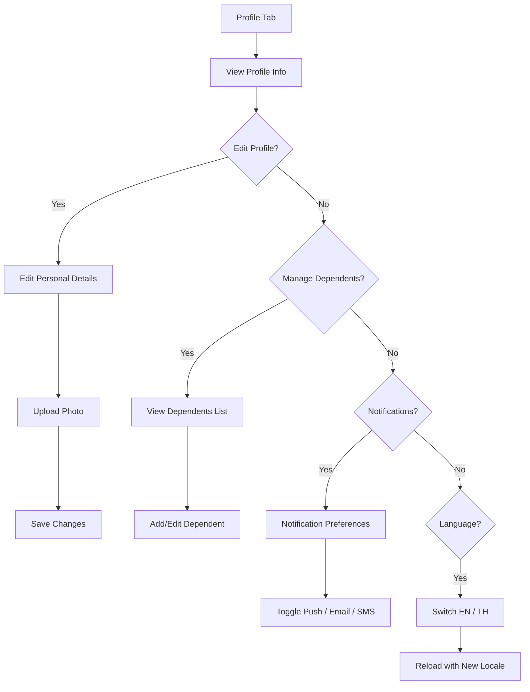
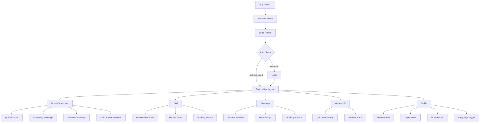
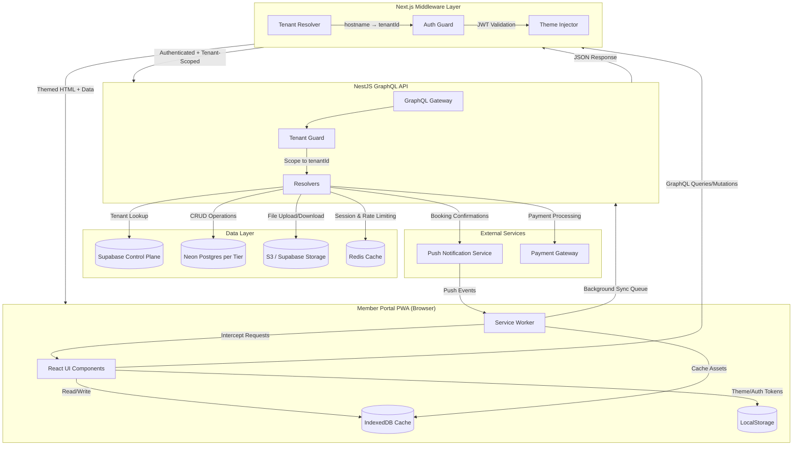
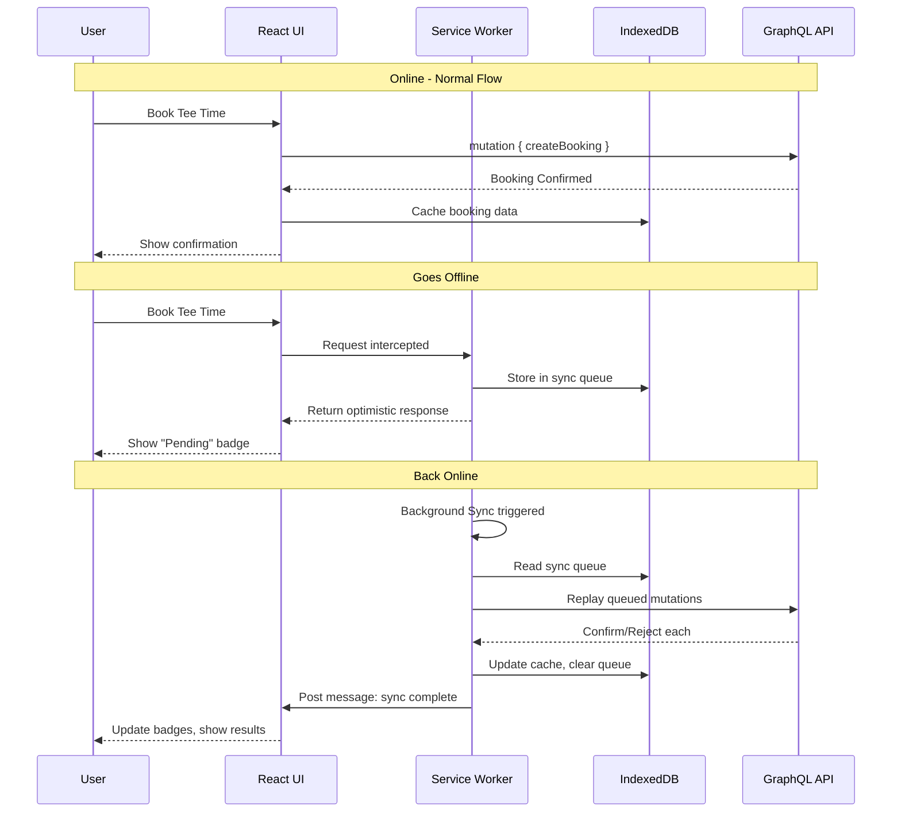
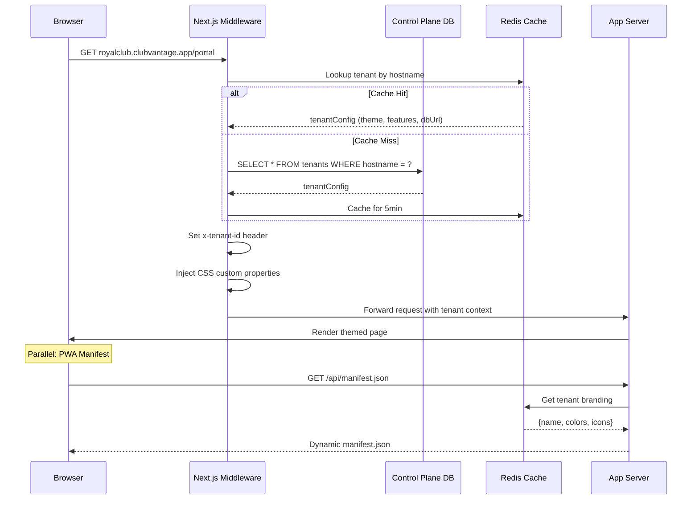

# Member Portal PWA Design

**Date**: 2026-02-06
**Status**: Design Complete
**Approach**: PWA-First (Progressive Web App), migrate to native later
**White-Label**: Full white-label platform — custom domains, dynamic manifest, per-club branding
**Scope**: Full Portal MVP — all features end-to-end
**Reference Club**: Royal Club

---

## Table of Contents

1. [Architecture Overview](#1-architecture-overview)
2. [Tenant Configuration & Theme System](#2-tenant-configuration--theme-system)
3. [Feature Modules & Flags](#3-feature-modules--flags)
4. [PWA Configuration](#4-pwa-configuration)
5. [Pages & Routes](#5-pages--routes)
6. [Data Flow & API Integration](#6-data-flow--api-integration)
7. [Offline & Performance Strategy](#7-offline--performance-strategy)
8. [User Flow Diagrams](#8-user-flow-diagrams)
9. [Stitch Design Prompts](#9-stitch-design-prompts)
10. [Staff Setup & Onboarding Guides](#10-staff-setup--onboarding-guides)

---

## 1. Architecture Overview

### Stack

| Layer | Technology | Purpose |
|-------|-----------|---------|
| Frontend | Next.js (App Router) | SSR + RSC for initial loads, client components for interactions |
| Styling | Tailwind CSS + CSS Custom Properties | Runtime theming via HSL variable injection |
| State | React Server Components + TanStack Query | Server-first data, client cache for mutations |
| Auth | JWT (httpOnly cookies) | Tenant-scoped authentication |
| PWA | next-pwa / Workbox | Service worker, manifest, offline support |
| API | NestJS GraphQL | Shared backend with staff application |
| Database | Neon Postgres (per tier) | Tenant-isolated data |
| Control Plane | Supabase | Tenant registry, hostname routing, feature flags |
| Cache | Redis | Tenant config (5min TTL), session data |
| Storage | S3 / Supabase Storage | Club logos, member photos, assets |

### Multi-Tenancy Model

```
Browser Request → Next.js Middleware → Tenant Resolution → Theme Injection → App Render
     │                                       │
     │                              ┌────────┴────────┐
     │                              │  Control Plane   │
     │                              │  (Supabase)      │
     │                              │  - tenant_id     │
     │                              │  - hostname      │
     │                              │  - tier          │
     │                              │  - features      │
     │                              │  - branding      │
     │                              └─────────────────┘
     │
     ▼
  Themed App (club-specific colors, logo, features)
```

- **Single deployment** serves all clubs
- Tenant resolved via hostname in Next.js middleware
- Each request carries `x-tenant-id` header downstream
- Database connection routed to correct Neon branch/instance per tier
- Redis caches tenant config for 5 minutes

### Key Principles

1. **Server-first**: Use RSC for initial page loads, client components only where interactivity is needed
2. **Offline-capable**: QR code member ID works offline, bookings queue for background sync
3. **White-label native**: Every visual element driven by tenant config, not hardcoded
4. **Mobile-first**: 390×844 viewport baseline, touch targets ≥44px, bottom navigation
5. **Incremental**: PWA today, Capacitor wrapper later for App Store distribution

---

## 2. Tenant Configuration & Theme System

### Tenant Config Schema

```typescript
interface TenantConfig {
  id: string
  slug: string                    // "royal-club"
  name: string                    // "Royal Club"
  tier: 'STARTER' | 'PROFESSIONAL' | 'ENTERPRISE'

  // Hostname routing
  hostnames: string[]             // ["royalclub.clubvantage.app", "app.royalclub.com"]

  // Branding
  branding: {
    logoUrl: string               // SVG preferred
    faviconUrl: string
    loginBackgroundUrl?: string
    splashScreenUrl?: string
    appName: string               // "Royal Club"
    shortName: string             // "Royal" (≤12 chars, PWA icon label)
    description: string
    welcomeMessage?: string       // Dashboard greeting
  }

  // Theme (HSL-based for Tailwind)
  theme: {
    primaryColor: string          // "#f59e0b" → auto-generates 50-950 HSL scale
    secondaryColor: string        // "#10b981"
    neutralColor: string          // "#78716c"
    fontFamily?: string           // Defaults to "DM Sans"
    borderRadius?: string         // Defaults to "0.75rem"
  }

  // Features (see Section 3)
  features: FeatureFlags

  // Database
  databaseUrl: string             // Neon connection string

  // Metadata
  createdAt: Date
  updatedAt: Date
}
```

### Theme Injection Flow

1. **Middleware** resolves tenant from hostname
2. **Redis** returns cached `TenantConfig` (or fetches from Control Plane)
3. **Middleware** injects CSS custom properties into response headers
4. **Root layout** reads properties and applies to `<html>` element
5. **Tailwind** maps CSS variables to utility classes

```css
/* Auto-generated per tenant */
:root {
  --color-primary-50: 48 96% 95%;
  --color-primary-100: 48 96% 89%;
  --color-primary-500: 38 92% 50%;
  --color-primary-600: 32 95% 44%;
  --color-primary-900: 22 78% 21%;

  --color-secondary-500: 160 84% 39%;
  --color-neutral-500: 25 5% 45%;

  --font-sans: "DM Sans", system-ui, sans-serif;
  --radius: 0.75rem;
}
```

```typescript
// tailwind.config.ts
module.exports = {
  theme: {
    extend: {
      colors: {
        primary: {
          50: 'hsl(var(--color-primary-50) / <alpha-value>)',
          500: 'hsl(var(--color-primary-500) / <alpha-value>)',
          // ... all shades
        }
      }
    }
  }
}
```

### Self-Service vs. Advanced Theming

| Feature | Club Staff (Self-Service) | Platform Manager (Advanced) |
|---------|--------------------------|---------------------------|
| Logo upload | Yes | Yes |
| Primary/secondary color | Yes (color picker) | Yes + custom HSL overrides |
| Welcome message | Yes | Yes |
| Font family | No | Yes |
| Border radius | No | Yes |
| Custom CSS | No | Yes (Enterprise tier only) |
| PWA metadata | No | Yes |
| Login background | No | Yes |

---

## 3. Feature Modules & Flags

### Flag Definitions

| Flag | Type | Default | Scope | Description |
|------|------|---------|-------|-------------|
| `golf.enabled` | boolean | true | Tenant | Show Golf tab in bottom nav |
| `golf.guestBooking` | boolean | true | Tenant | Allow guests in tee time bookings |
| `golf.cartRequest` | boolean | true | Tenant | Members can request carts |
| `golf.caddyRequest` | boolean | false | Tenant | Members can request caddies |
| `bookings.enabled` | boolean | true | Tenant | Show Bookings tab |
| `bookings.autoApprove` | boolean | false | Facility | Auto-confirm facility bookings |
| `billing.enabled` | boolean | true | Tenant | Show Statements tab |
| `billing.onlinePayments` | boolean | false | Tenant | Enable Pay Now flow |
| `billing.showBalance` | boolean | true | Tenant | Show balance on dashboard |
| `portal.memberIdQr` | boolean | true | Tenant | QR code Member ID screen |
| `portal.pushNotifications` | boolean | true | Tenant | Push notification subscription |
| `portal.darkMode` | boolean | false | Tenant | Dark mode toggle in profile |
| `portal.languageSwitcher` | boolean | true | Tenant | EN/TH language toggle |
| `portal.dependentAccess` | boolean | true | Tenant | Dependents can log in |

### Flag Resolution

```typescript
// Server component
import { getTenantConfig } from '@/lib/tenant'

export default async function BottomNav() {
  const { features } = await getTenantConfig()

  const tabs = [
    { id: 'home', label: 'Home', icon: Home, always: true },
    { id: 'golf', label: 'Golf', icon: Flag, enabled: features.golf.enabled },
    { id: 'bookings', label: 'Bookings', icon: Calendar, enabled: features.bookings.enabled },
    { id: 'id', label: 'ID', icon: QrCode, enabled: features.portal.memberIdQr },
    { id: 'profile', label: 'Profile', icon: User, always: true },
  ]

  return <NavBar tabs={tabs.filter(t => t.always || t.enabled)} />
}
```

### Module → Tab Mapping

| Module | Bottom Nav Tab | Sub-pages |
|--------|---------------|-----------|
| Dashboard | Home | Quick actions, upcoming, balance, news |
| Golf | Golf | Browse tee times, my tee times, booking flow |
| Bookings | Bookings | Browse facilities, my bookings, booking flow |
| Member ID | ID | QR code, member card |
| Statements | (via Home/Profile) | Balance, transactions, statements, payments |
| Profile | Profile | Personal info, dependents, preferences, settings |

---

## 4. PWA Configuration

### Manifest (Dynamic per Tenant)

```typescript
// app/api/manifest.json/route.ts
export async function GET(request: Request) {
  const tenant = await resolveTenant(request)

  return Response.json({
    name: tenant.branding.appName,
    short_name: tenant.branding.shortName,
    description: tenant.branding.description,
    start_url: '/portal',
    display: 'standalone',
    background_color: tenant.theme.backgroundColor || '#fafaf9',
    theme_color: tenant.theme.primaryColor,
    orientation: 'portrait',
    icons: [
      { src: tenant.branding.faviconUrl, sizes: '192x192', type: 'image/png' },
      { src: tenant.branding.faviconUrl, sizes: '512x512', type: 'image/png' },
      { src: tenant.branding.faviconUrl, sizes: '512x512', type: 'image/png', purpose: 'maskable' },
    ],
    categories: ['lifestyle', 'sports'],
  })
}
```

### Service Worker Strategy

| Resource | Strategy | TTL | Rationale |
|----------|----------|-----|-----------|
| App shell (HTML) | Network-first | 24h fallback | Always fresh, offline fallback |
| Static assets (JS/CSS) | Cache-first | Immutable | Hashed filenames, never changes |
| API responses (GET) | Stale-while-revalidate | 5min | Fast reads, background refresh |
| API mutations (POST) | Network-only + Background Sync | Queue | Must reach server |
| Images (logos, photos) | Cache-first | 7 days | Rarely change |
| Fonts | Cache-first | 30 days | Never change |
| QR code payload | Network-first → IndexedDB fallback | 24h | Must work offline |

### Push Notifications

```typescript
// Service worker push handler
self.addEventListener('push', (event) => {
  const data = event.data?.json()

  // Notification types
  // - booking.confirmed
  // - booking.reminder
  // - payment.received
  // - announcement.published
  // - statement.due

  event.waitUntil(
    self.registration.showNotification(data.title, {
      body: data.body,
      icon: data.icon || '/icon-192.png',
      badge: '/badge-72.png',
      tag: data.tag,
      data: { url: data.url },
    })
  )
})
```

### Install Prompt

- Custom install banner triggered after 2nd visit (not first)
- Bottom sheet design showing benefits: quick access, push notifications, offline QR
- Respects `beforeinstallprompt` event
- "Maybe Later" dismisses for 7 days (stored in localStorage)

---

## 5. Pages & Routes

### Route Structure

```
apps/member-portal/src/app/
├── (auth)/
│   ├── login/page.tsx              # Login screen
│   ├── forgot-password/page.tsx    # Password reset
│   └── onboarding/page.tsx         # First-login walkthrough
├── portal/
│   ├── layout.tsx                  # Bottom nav + auth guard
│   ├── page.tsx                    # Dashboard / Home
│   ├── golf/
│   │   ├── page.tsx                # Browse tee times
│   │   ├── book/[slotId]/page.tsx  # Booking flow (add players, review, confirm)
│   │   └── my-times/page.tsx       # My tee times (upcoming + past)
│   ├── bookings/
│   │   ├── page.tsx                # Browse facilities
│   │   ├── [facilityId]/page.tsx   # Calendar + time selection
│   │   ├── book/[facilityId]/page.tsx  # Booking details + confirm
│   │   └── my-bookings/page.tsx    # My facility bookings
│   ├── id/
│   │   └── page.tsx                # Member ID + QR code
│   ├── statements/
│   │   ├── page.tsx                # Balance + transactions
│   │   └── [statementId]/page.tsx  # Statement detail + line items
│   ├── profile/
│   │   ├── page.tsx                # Profile overview + settings
│   │   ├── edit/page.tsx           # Edit personal info
│   │   ├── dependents/page.tsx     # Manage dependents
│   │   └── preferences/page.tsx    # Notifications, language, dark mode
│   └── notifications/
│       └── page.tsx                # Notification center
├── api/
│   ├── manifest.json/route.ts      # Dynamic PWA manifest
│   ├── health/route.ts             # Tenant health check
│   └── push/
│       └── subscribe/route.ts      # Push notification subscription
└── sw.ts                           # Service worker entry
```

### Page → Component Mapping

| Page | Key Components | Server/Client |
|------|---------------|---------------|
| Login | LoginForm, ClubLogo, ThemeBackground | Client (form interactions) |
| Dashboard | BalanceCard, QuickActions, UpcomingList, Announcements | Server (initial) + Client (interactions) |
| Golf Browse | DateSelector, CourseSelector, TimeSlotList, SlotCard | Client (scroll, filter) |
| Golf Book | PlayerList, GuestForm, RentalToggles, PriceSummary | Client (form) |
| My Tee Times | BookingCard, StatusBadge, TabFilter | Server + Client |
| Facility Browse | CategoryFilter, FacilityCard, SearchBar | Client (filter, scroll) |
| Facility Book | Calendar, TimeGrid, DurationStepper, PriceSummary | Client (form) |
| Member ID | QRCodeDisplay, MemberCard, OfflineIndicator | Server + Client (offline) |
| Statements | BalanceSummary, TransactionList, StatementRow | Server (data) + Client (filter) |
| Profile | AvatarUpload, InfoForm, SettingsToggle, LanguagePicker | Client (form) |
| Notifications | NotificationList, FilterPills, ReadToggle | Server + Client |

---

## 6. Data Flow & API Integration

### GraphQL Operations

#### Golf Module

```graphql
# Browse available tee times
query AvailableTeeTimes($courseId: ID!, $date: Date!) {
  availableTeeTimes(courseId: $courseId, date: $date) {
    id
    startTime
    endTime
    availableSlots
    maxPlayers
    price { amount currency }
    status
  }
}

# Create tee time booking
mutation CreateTeeTimeBooking($input: CreateTeeTimeBookingInput!) {
  createTeeTimeBooking(input: $input) {
    id
    status
    confirmationCode
    players { name type }
    startTime
    course { name }
  }
}

# My tee times
query MyTeeTimes($status: [BookingStatus!], $after: DateTime) {
  myTeeTimes(status: $status, after: $after) {
    id
    startTime
    course { name }
    players { name type }
    cartRequested
    caddyRequested
    status
  }
}
```

#### Facility Module

```graphql
# Browse facilities
query Facilities($category: String) {
  facilities(category: $category) {
    id
    name
    category
    description
    imageUrl
    pricePerHour { amount currency }
    amenities
    availableToday
  }
}

# Facility availability
query FacilityAvailability($facilityId: ID!, $date: Date!) {
  facilityAvailability(facilityId: $facilityId, date: $date) {
    timeSlots {
      startTime
      endTime
      available
    }
  }
}

# Book facility
mutation BookFacility($input: BookFacilityInput!) {
  bookFacility(input: $input) {
    id
    status
    confirmationCode
    facility { name }
    startTime
    endTime
    totalPrice { amount currency }
  }
}
```

#### Billing Module

```graphql
# Account balance
query AccountBalance {
  memberBalance {
    currentBalance { amount currency }
    dueDate
    lastPaymentDate
    lastPaymentAmount { amount currency }
  }
}

# Statements
query Statements($year: Int, $month: Int) {
  statements(year: $year, month: $month) {
    id
    period
    totalAmount { amount currency }
    lineItems {
      date
      description
      category
      amount { amount currency }
    }
    pdfUrl
  }
}
```

#### Member Module

```graphql
# Member profile
query MemberProfile {
  me {
    id
    firstName
    lastName
    email
    phone
    membershipType
    memberSince
    status
    photoUrl
    qrPayload
    dependents { id name relationship }
  }
}

# Update profile
mutation UpdateProfile($input: UpdateProfileInput!) {
  updateProfile(input: $input) {
    id
    firstName
    lastName
    phone
    photoUrl
  }
}
```

### Data Fetching Pattern

```typescript
// Server component — initial load
export default async function GolfPage() {
  const courses = await graphqlClient.query({ query: GET_COURSES })
  const today = new Date()
  const slots = await graphqlClient.query({
    query: AVAILABLE_TEE_TIMES,
    variables: { courseId: courses[0].id, date: today }
  })

  return <TeeTimesBrowser initialCourses={courses} initialSlots={slots} />
}

// Client component — interactions
'use client'
function TeeTimesBrowser({ initialCourses, initialSlots }) {
  const [selectedDate, setSelectedDate] = useState(new Date())
  const [selectedCourse, setSelectedCourse] = useState(initialCourses[0].id)

  const { data: slots } = useQuery({
    queryKey: ['tee-times', selectedCourse, selectedDate],
    queryFn: () => fetchTeeTimes(selectedCourse, selectedDate),
    initialData: initialSlots,
  })

  return (/* ... */)
}
```

---

## 7. Offline & Performance Strategy

### Offline Capabilities

| Feature | Offline Behavior | Storage |
|---------|-----------------|---------|
| Member ID / QR | Full offline — cached QR payload | IndexedDB |
| Dashboard | Stale data from last visit | Service worker cache |
| Tee time browse | Stale data with "Offline" banner | Service worker cache |
| Tee time booking | Queued with "Pending Sync" badge | IndexedDB sync queue |
| Facility browse | Stale data with "Offline" banner | Service worker cache |
| Facility booking | Queued with "Pending Sync" badge | IndexedDB sync queue |
| Statements | Stale data from last visit | Service worker cache |
| Profile | Read-only from cache | Service worker cache |
| Notifications | Not available offline | — |

### Background Sync Queue

```typescript
// When offline, queue mutations
async function queueMutation(mutation: QueuedMutation) {
  const db = await openDB('portal-sync', 1)
  await db.add('sync-queue', {
    id: crypto.randomUUID(),
    mutation: mutation.query,
    variables: mutation.variables,
    timestamp: Date.now(),
    status: 'pending',
  })

  // Register background sync
  const sw = await navigator.serviceWorker.ready
  await sw.sync.register('sync-mutations')
}

// Service worker handles sync
self.addEventListener('sync', (event) => {
  if (event.tag === 'sync-mutations') {
    event.waitUntil(processSyncQueue())
  }
})

async function processSyncQueue() {
  const db = await openDB('portal-sync', 1)
  const queue = await db.getAll('sync-queue')

  for (const item of queue) {
    try {
      await fetch('/api/graphql', {
        method: 'POST',
        body: JSON.stringify({ query: item.mutation, variables: item.variables }),
      })
      await db.delete('sync-queue', item.id)
    } catch {
      break // Still offline, stop processing
    }
  }

  // Notify UI of sync results
  const clients = await self.clients.matchAll()
  clients.forEach(client => client.postMessage({ type: 'SYNC_COMPLETE' }))
}
```

### Performance Targets

| Metric | Target | Strategy |
|--------|--------|----------|
| First Contentful Paint | < 1.5s | SSR + edge caching |
| Largest Contentful Paint | < 2.5s | Image optimization + preload |
| Time to Interactive | < 3.0s | Code splitting + lazy loading |
| Cumulative Layout Shift | < 0.1 | Skeleton screens + fixed layouts |
| First Input Delay | < 100ms | Minimal client JS on initial load |
| Bundle size (initial) | < 150KB gzipped | Tree shaking + direct imports |

### Code Splitting Strategy

```typescript
// Lazy load modules based on feature flags
const GolfModule = dynamic(() => import('@/modules/golf'), {
  loading: () => <ModuleSkeleton />
})
const BookingsModule = dynamic(() => import('@/modules/bookings'), {
  loading: () => <ModuleSkeleton />
})

// Only load what the tenant has enabled
{features.golf.enabled && <GolfModule />}
{features.bookings.enabled && <BookingsModule />}
```

---

## 8. User Flow Diagrams

### 8.1 Authentication & Onboarding



### 8.2 Tee Time Booking



### 8.3 Facility Booking



### 8.4 Member ID / QR Code



### 8.5 Statement & Payment



### 8.6 Profile Management



### 8.7 Overall App Navigation



### 8.8 Data Flow Architecture



### 8.9 Offline Data Sync



### 8.10 Tenant Resolution & Theming



---

## 9. Stitch Design Prompts

Prompts for Google Stitch AI to generate mobile UI screens. Paste each directly into Stitch. All target 390×844 viewport, DM Sans typography, amber/emerald/stone palette (overridden per tenant).

### 9.1 Login Screen

```
Design a mobile login screen (390x844) for a luxury country club member app called "Royal Club".

- Clean white background with subtle stone-50 tint
- Club logo centered at top (placeholder circular logo with "RC" monogram, gold/amber accent)
- Welcome text: "Welcome Back" in DM Sans semibold 24px, dark stone-900
- Subtitle: "Sign in to your member account" in stone-500 14px
- Email input field with rounded-lg border, stone-200 border color, left icon (mail)
- Password input field with rounded-lg border, eye toggle icon on right
- "Remember me" checkbox row with "Forgot password?" link aligned right in amber-600
- Primary CTA button: "Sign In" — full width, rounded-xl, amber-500 background, white text, DM Sans semibold
- Divider with "or" text
- "Sign in with Face ID" secondary button with fingerprint icon, outlined style
- Bottom text: "Need help? Contact your club" in stone-400 12px
- No bottom navigation bar on this screen
- Luxury minimal aesthetic, generous whitespace, no gradients except subtle on CTA hover
```

### 9.2 Dashboard / Home

```
Design a mobile dashboard screen (390x844) for a luxury country club member app.

TOP SECTION:
- Status bar area at top
- Greeting: "Good Morning, James" in DM Sans semibold 20px stone-900
- Subtitle: "Member since 2019" in stone-500 13px
- Small circular avatar photo top-right with amber ring border
- Weather widget pill: "28°C Sunny" with sun icon, stone-100 background, rounded-full

BALANCE CARD:
- Glassmorphism card (white/80 backdrop-blur, rounded-2xl, shadow-lg)
- "Current Balance" label in stone-500 12px
- "฿45,200" in DM Sans bold 32px stone-900
- "Due by Feb 28" in amber-600 13px
- Small "Pay Now" pill button, amber-500 bg, white text, rounded-full

QUICK ACTIONS ROW:
- 4 circular icon buttons in a row with labels below
- Icons: Golf tee (Book Tee Time), Calendar (Facilities), QR code (Member ID), Receipt (Statements)
- Each icon in amber-50 circle background with amber-600 icon color
- Labels in stone-600 11px DM Sans medium

UPCOMING SECTION:
- Section header: "Upcoming" with "See All" link in amber-600
- Card 1: Tee time card — rounded-xl, white bg, shadow-sm
  - Left: Green circle with golf flag icon
  - "Tomorrow, 7:30 AM" bold, "Championship Course · 4 Players" subtitle
  - Right: amber chevron
- Card 2: Facility booking — rounded-xl
  - Left: Blue circle with dumbbell icon
  - "Feb 10, 3:00 PM" bold, "Tennis Court A · 1 hour" subtitle

ANNOUNCEMENTS:
- Section header: "Club News"
- Horizontal scroll card: image placeholder with overlay text "Valentine's Dinner — Feb 14" rounded-xl

BOTTOM NAVIGATION:
- 5 tabs: Home (filled), Golf, Bookings, ID, Profile
- Active tab: amber-500 icon + text, others stone-400
- Rounded-2xl floating bar style with white bg and shadow, 16px margin from edges
```

### 9.3 Golf — Browse Tee Times

```
Design a mobile tee time browsing screen (390x844) for a country club golf booking app.

HEADER:
- Back arrow left, title "Book Tee Time" center in DM Sans semibold 18px
- Filter icon button top-right

DATE SELECTOR:
- Horizontal scrolling date pills showing 7 days
- Each pill: day abbreviation (Mon, Tue...) top in 11px, date number below in 16px bold
- Selected date: amber-500 bg with white text, rounded-xl
- Unselected: stone-100 bg, stone-600 text
- Today pill has small amber dot indicator below

COURSE SELECTOR:
- Dropdown/pill selector: "Championship Course ▾" in rounded-lg stone-100 bg, full width
- Small text below: "18 Holes · Par 72"

TIME SLOTS LIST:
- Section headers by time period: "Morning", "Afternoon" in stone-500 12px uppercase tracking-wide
- Each slot is a card (rounded-xl, white bg, shadow-sm, padding 16px):
  - Left column: Time "7:00 AM" in DM Sans semibold 16px stone-900
  - Center column:
    - Player dots row: 4 circles, filled = booked (stone-300), empty = available (amber-500 ring)
    - "2 of 4 spots" in stone-500 12px
  - Right column:
    - Price "฿2,400" in stone-900 14px bold
    - "Book" button — small pill, amber-500 bg, white text
- Fully booked slots: muted styling, "Full" text in stone-400, no book button
- Blocked slots: gray-200 bg, diagonal stripe pattern, "Maintenance" label

BOTTOM NAVIGATION:
- Same 5-tab bottom nav, Golf tab active (amber-500)
```

### 9.4 Golf — Booking Confirmation

```
Design a mobile tee time booking review screen (390x844) for a country club app.

HEADER:
- Back arrow, title "Review Booking" center

BOOKING SUMMARY CARD:
- Large rounded-2xl card, white bg, shadow-lg
- Top section with amber-50 bg rounded-t-2xl:
  - Golf flag icon in amber-500 circle
  - "Championship Course" DM Sans semibold 18px
  - "Saturday, Feb 8, 2026" in stone-600 14px
  - "7:30 AM" in DM Sans bold 28px stone-900

PLAYERS SECTION:
- Section title "Players (3 of 4)" with "+ Add Player" link in amber-600
- Player 1: Avatar circle, "James Wilson (You)" with blue "M" badge (Member), checkmark
- Player 2: Avatar circle, "Sarah Wilson" with teal "D" badge (Dependent)
- Player 3: Avatar circle, "Tom Guest" with amber "G" badge (Guest)
- Empty slot 4: Dashed circle outline, "Add player" in stone-400

RENTALS SECTION:
- Section title "Cart & Caddy"
- Toggle row: "Golf Cart" with switch toggle (on = amber-500)
- Toggle row: "Caddy" with switch toggle (off = stone-300)
- Cart selected shows: "Shared Cart · ฿800" in emerald-600

PRICE BREAKDOWN:
- Divider line
- Row: "Green Fee (Member) × 1" — "฿2,400"
- Row: "Green Fee (Dependent) × 1" — "฿1,800"
- Row: "Guest Fee × 1" — "฿3,200"
- Row: "Shared Golf Cart" — "฿800"
- Divider
- Total row: "Total" bold — "฿8,200" in DM Sans bold 20px stone-900

CTA:
- Full-width button: "Confirm Booking" — amber-500 bg, white text, rounded-xl, 56px height
- "Cancel" text link below in stone-500

No bottom nav on this screen (it's a modal flow)
```

### 9.5 Golf — My Tee Times

```
Design a mobile "My Tee Times" screen (390x844) for a country club app.

HEADER:
- Title "My Tee Times" left-aligned DM Sans semibold 20px
- Filter pills row: "Upcoming" (active, amber-500 bg white text), "Past" (stone-100 bg stone-600 text), rounded-full

UPCOMING BOOKINGS:
- Card 1 (next up, featured):
  - Larger card, rounded-2xl, white bg, shadow-md
  - Top amber-500 accent bar (4px tall, full width, rounded-t)
  - "TOMORROW" badge in amber-100 text-amber-700 rounded-full 11px uppercase
  - "7:30 AM" DM Sans bold 24px
  - "Championship Course" in stone-600 15px
  - Player avatars row: 3 overlapping circles + "+1" pill
  - Row of pills: "Cart ✓" in emerald-100/emerald-700, "No Caddy" in stone-100/stone-500
  - Two buttons at bottom: "Check In" amber-500 bg white (primary), "Modify" outlined amber-500 border

- Card 2 (future):
  - Standard card, rounded-xl, white bg, shadow-sm
  - "Feb 15 · 10:00 AM" semibold 16px
  - "Lake Course" stone-600
  - "2 Players" stone-500 13px
  - Status badge: "Confirmed" emerald-500 bg white text rounded-full

- Card 3 (pending):
  - Standard card with amber-100 left border (4px)
  - "Feb 22 · 8:00 AM"
  - Status badge: "Pending" amber-500 bg white text

EMPTY STATE (for Past tab):
- Centered illustration placeholder (golf flag line drawing)
- "No past bookings" in stone-500

BOTTOM NAVIGATION: Golf tab active
```

### 9.6 Member ID / QR Code

```
Design a mobile Member ID screen (390x844) for a luxury country club app.

BACKGROUND:
- Gradient background from amber-50 at top to white at bottom

MEMBER CARD:
- Large card centered, rounded-2xl, aspect ratio ~1.6:1 (credit card shape)
- Background: dark gradient (stone-900 to stone-800) with subtle geometric pattern
- Top-left: Club logo "RC" in amber-500
- Top-right: "ROYAL CLUB" in white tracking-widest 11px
- Center: Large QR code (white bg, rounded-lg, ~180x180px) with amber-500 corner accents
- Below QR: "Scan for check-in & charges" in stone-400 11px
- Bottom-left:
  - "JAMES WILSON" white DM Sans semibold 16px
  - "Premium Member" in amber-400 12px
- Bottom-right:
  - "ID: RC-2024-0847" in stone-400 11px
  - "Since 2019" in stone-500 10px

BELOW CARD:
- "Tap to enlarge" hint text in stone-400 12px with expand icon

INFO SECTION:
- Rounded-xl white card, shadow-sm
- Row: "Membership" — "Premium" with amber badge
- Row: "Status" — "Active" with emerald-500 dot
- Row: "Valid Through" — "Dec 31, 2026"
- Row: "Dependents" — "2" with right chevron

OFFLINE INDICATOR:
- When offline: small banner at top "Available Offline ✓" in emerald-100 bg emerald-700 text

BOTTOM NAVIGATION: ID tab active (amber-500)
```

### 9.7 Statements & Billing

```
Design a mobile Statements screen (390x844) for a country club member app.

HEADER:
- Title "Statements" left-aligned 20px semibold
- Period selector pill: "February 2026 ▾" in rounded-lg stone-100 bg

BALANCE SUMMARY CARD:
- Rounded-2xl, gradient bg from amber-500 to amber-600, white text
- "Outstanding Balance" in white/80 13px
- "฿45,200" in white DM Sans bold 36px
- "Due Feb 28, 2026" in white/70 13px
- "Pay Now" button: white bg, amber-600 text, rounded-xl, shadow

RECENT TRANSACTIONS:
- Section title "Recent Activity" with "See All" link
- List items with subtle dividers:
  - Each row: Category icon (left, in colored circle), description + date (center), amount (right)
  - Row 1: Green fee icon (amber circle), "Green Fee - Championship", "Feb 5", "-฿2,400" in red-500
  - Row 2: Fork/knife icon (emerald circle), "Clubhouse Restaurant", "Feb 4", "-฿1,850" in red-500
  - Row 3: Check icon (emerald circle), "Payment Received", "Feb 1", "+฿10,000" in emerald-600
  - Row 4: Cart icon (blue circle), "Cart Rental", "Jan 30", "-฿800" in red-500

STATEMENT HISTORY:
- Section title "Monthly Statements"
- List of downloadable statements:
  - Row: "January 2026" — "฿38,400" — PDF download icon in amber-600
  - Row: "December 2025" — "฿42,100" — PDF icon
  - Row: "November 2025" — "฿35,800" — PDF icon
- Each row has right chevron for detail view

BOTTOM NAVIGATION: Home tab (navigated from profile or home)
```

### 9.8 Facility Bookings — Browse

```
Design a mobile facility browsing screen (390x844) for a country club booking app.

HEADER:
- Title "Book Facility" with search icon top-right

CATEGORY FILTER:
- Horizontal scroll pills: "All" (active amber), "Tennis", "Swimming", "Dining", "Fitness", "Events"
- Stone-100 bg inactive, amber-500 bg active

FACILITY CARDS (vertical scroll):
- Card 1: Tennis
  - Rounded-2xl, image placeholder top (tennis court aerial view), aspect 16:9
  - Below image: "Tennis Court" DM Sans semibold 17px
  - "4 courts available" in emerald-600 13px with green dot
  - "฿500/hour" in stone-600 13px
  - Row of amenity pills: "Lights" "Equipment" in stone-100 rounded-full 11px
  - "Book Now" text link in amber-600

- Card 2: Private Dining
  - Image placeholder (elegant dining room)
  - "Private Dining Room"
  - "Available today" emerald text
  - "฿5,000/session"
  - Pills: "12 Guests" "AV System" "Catering"

- Card 3: Swimming Pool
  - Image placeholder (pool)
  - "Olympic Pool — Lane Booking"
  - "3 lanes available"
  - "฿300/hour"

- Card 4: Function Hall (partially visible, scrollable)
  - Image placeholder
  - "Grand Ballroom"
  - "Next available: Feb 15"

BOTTOM NAVIGATION: Bookings tab active
```

### 9.9 Facility Booking — Calendar & Time Selection

```
Design a mobile date/time selection screen (390x844) for booking a facility at a country club.

HEADER:
- Back arrow, title "Tennis Court" center
- Subtitle below: "Select date and time" in stone-500 13px

FACILITY INFO MINI-CARD:
- Horizontal card: small image left (rounded-lg), "Tennis Court A" title, "Outdoor · Lights available" subtitle, "฿500/hr" right-aligned

CALENDAR:
- Monthly calendar view, current month "February 2026"
- Left/right month arrows
- Day headers: S M T W T F S in stone-400 12px
- Available dates: stone-900 text on white
- Unavailable dates: stone-300 text
- Selected date: amber-500 circle bg, white text
- Today: amber-500 ring outline (not filled)
- Dates with bookings: small emerald dot below the number

TIME SLOTS:
- Section: "Available Times" for selected date
- Grid of time pills (3 columns):
  - Available: white bg, stone-200 border, stone-900 text
  - Selected: amber-500 bg, white text
  - Unavailable: stone-100 bg, stone-300 text, strikethrough
  - Times: "8:00 AM", "9:00 AM", "10:00 AM", "11:00 AM", "1:00 PM", "2:00 PM", "3:00 PM", "4:00 PM", "5:00 PM"

DURATION SELECTOR:
- "Duration" label
- Stepper: minus button [–] "1 hour" plus button [+], stone-200 borders, amber-500 active buttons

STICKY BOTTOM CTA:
- White bg bar with shadow-t
- "฿500" total price left, "Continue" amber-500 button right
```

### 9.10 Profile & Settings

```
Design a mobile profile screen (390x844) for a country club member app.

PROFILE HEADER:
- Large circular avatar (80px) centered with amber ring border and camera edit icon overlay (bottom-right)
- "James Wilson" DM Sans semibold 22px centered
- "Premium Member" in amber-600 14px
- "ID: RC-2024-0847" in stone-400 12px

QUICK STATS ROW:
- 3 columns evenly spaced in rounded-xl stone-50 card:
  - "12" bold + "Rounds" label (this month golf)
  - "8" bold + "Bookings" label
  - "2019" bold + "Member Since"

SETTINGS SECTIONS:
- Section: "Account" (stone-500 12px uppercase header)
  - Row: User icon, "Personal Information", right chevron
  - Row: Users icon, "Dependents (2)", right chevron
  - Row: Shield icon, "Privacy & Security", right chevron

- Section: "Preferences"
  - Row: Bell icon, "Notifications", toggle switch (on, amber-500)
  - Row: Globe icon, "Language", "English" value + chevron
  - Row: Moon icon, "Dark Mode", toggle switch (off, stone-300)

- Section: "Billing"
  - Row: CreditCard icon, "Payment Methods", right chevron
  - Row: Receipt icon, "Billing Address", right chevron

- Section: "Support"
  - Row: HelpCircle icon, "Help & FAQ", right chevron
  - Row: MessageSquare icon, "Contact Club", right chevron
  - Row: Info icon, "About", "v1.0.0" value

SIGN OUT:
- "Sign Out" text button in red-500 centered, 16px, with logout icon
- 32px bottom padding above nav

BOTTOM NAVIGATION: Profile tab active
```

### 9.11 Notifications Panel

```
Design a mobile notifications screen (390x844) for a country club member app.

HEADER:
- Title "Notifications" left, "Mark all read" link right in amber-600 13px
- Filter pills: "All" (active), "Bookings", "Billing", "Club News"

NOTIFICATION LIST:
- Today section header

- Item 1 (unread — amber-50 bg, amber-500 left bar 3px):
  - Golf icon in amber circle (40px)
  - "Tee Time Confirmed" semibold 15px
  - "Championship Course · Tomorrow 7:30 AM" in stone-600 13px
  - "2 minutes ago" in stone-400 11px

- Item 2 (unread):
  - CreditCard icon in emerald circle
  - "Payment Received"
  - "฿10,000 credited to your account"
  - "1 hour ago"

- Yesterday section header

- Item 3 (read — white bg, no left bar):
  - Calendar icon in blue circle
  - "Booking Reminder"
  - "Tennis Court A tomorrow at 3:00 PM"
  - "Yesterday, 6:00 PM"

- Item 4 (read):
  - Megaphone icon in purple circle
  - "Valentine's Dinner Event"
  - "Reserve your table for Feb 14 special dinner"
  - "Yesterday, 10:00 AM"

- Earlier section
- Item 5 (read):
  - AlertTriangle icon in red circle
  - "Statement Due"
  - "Your January statement of ฿38,400 is due Feb 15"
  - "Feb 3"

EMPTY STATE (if no notifications):
- Bell icon with slash, "No notifications yet" in stone-400
```

### 9.12 Add to Home Screen / Install Prompt

```
Design a mobile PWA install prompt overlay (390x844) for a country club app.

BACKGROUND: Semi-transparent dark overlay (black/50) over blurred app content

BOTTOM SHEET (slides up from bottom):
- Rounded-t-3xl white bg, drag handle bar top center
- Club logo "RC" in amber circle (56px) centered
- "Add Royal Club to Home Screen" DM Sans semibold 20px centered
- "Get quick access to tee times, bookings, and your member ID" stone-600 14px centered, max 2 lines

BENEFITS LIST:
- Row: Zap icon amber, "Instant access from your home screen"
- Row: Bell icon amber, "Push notifications for bookings & updates"
- Row: WifiOff icon amber, "Works offline — view your Member ID anytime"

VISUAL:
- Phone mockup illustration showing the app icon on a home screen (simplified)

BUTTONS:
- "Add to Home Screen" — full width, amber-500 bg, white text, rounded-xl, 52px
- "Maybe Later" — text button stone-500 14px below
- 34px bottom safe area padding
```

---

## 10. Staff Setup & Onboarding Guides

Setup documentation lives at `docs/setup/member-portal/`. See individual files:

| Document | Path | Audience |
|----------|------|----------|
| Tenant Onboarding | `docs/setup/member-portal/tenant-onboarding.md` | ClubVantage staff |
| Club Staff Guide | `docs/setup/member-portal/club-staff-guide.md` | Club operations staff |
| PWA Configuration | `docs/setup/member-portal/pwa-configuration.md` | Technical reference |
| Theme Configuration | `docs/setup/member-portal/theme-configuration.md` | Technical reference |
| Feature Flags | `docs/setup/member-portal/feature-flags.md` | Technical reference |

### Go-Live Checklist

- [ ] Tenant resolves on production hostname
- [ ] Branding matches club's visual identity
- [ ] PWA installs correctly on iOS Safari & Android Chrome
- [ ] Push notifications deliver (test with staff account)
- [ ] Member login flow works (email + password)
- [ ] QR code scans and verifies at reception
- [ ] Tee time booking flow end-to-end (if golf enabled)
- [ ] Facility booking flow end-to-end (if bookings enabled)
- [ ] Statement displays with correct balance (if billing enabled)
- [ ] Offline mode: QR code displays, pending badge on bookings
- [ ] Custom domain SSL cert valid (if applicable)
- [ ] Analytics tracking fires events (page views, bookings)

---

## Affected Feature Specs

This plan affects the following feature specs (to be updated):

| Spec | Impact |
|------|--------|
| `members/profiles/spec.md` | New member portal profile management capability |
| `members/management/spec.md` | Portal invitation, activation, dependent access |
| `golf/tee-sheet/booking/spec.md` | Member-facing booking flow via portal |
| `golf/tee-sheet/check-in/spec.md` | QR code check-in from member ID |
| `golf/carts/spec.md` | Member cart request from portal |
| `golf/caddies/spec.md` | Member caddy request from portal |
| `bookings/calendar/spec.md` | Member-facing facility booking |
| `bookings/facilities/spec.md` | Facility browsing from portal |
| `billing/ar-statements/spec.md` | Member statement viewing and payment |
| `platform/multi-tenancy/spec.md` | White-label PWA tenant configuration |
| `platform/i18n/spec.md` | Portal language switching |

---

## Implementation Phases

### Phase 1: Foundation (Week 1-2)
- Tenant-aware middleware + theme injection
- Dynamic manifest endpoint
- Auth flow (login, JWT, session)
- Bottom nav layout with feature flag tabs
- Service worker setup

### Phase 2: Core Screens (Week 3-4)
- Dashboard with balance card, quick actions, upcoming
- Member ID with QR code + offline support
- Profile with edit, dependents, preferences
- Notification center

### Phase 3: Golf Module (Week 5-6)
- Browse tee times (date, course, slots)
- Booking flow (players, guests, cart/caddy, confirm)
- My tee times (upcoming, past, cancel/modify)

### Phase 4: Bookings & Billing (Week 7-8)
- Facility browsing + category filter
- Facility booking flow (calendar, time, confirm)
- Statements + transaction history
- Online payment flow (if enabled)

### Phase 5: Polish & Launch (Week 9-10)
- Offline sync queue + background sync
- Push notifications end-to-end
- Install prompt + onboarding walkthrough
- Performance optimization (bundle, caching)
- Staff setup guides + documentation
- QA across iOS Safari + Android Chrome
